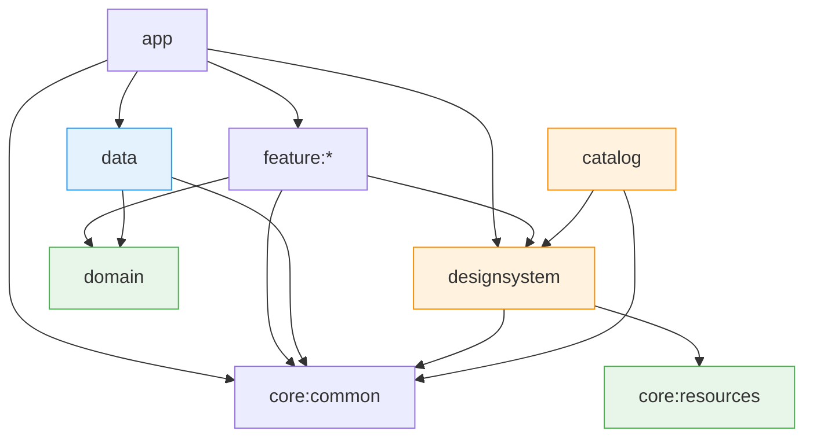

# Architecture Guide

이 문서는 DMinus14 Android 프로젝트의 아키텍처, 모듈 책임, 의존성 규칙, MVI 작성 규칙, 공통 에러 처리 방향, 디자인 시스템 카탈로그 운영 방향을 설명한다.

프로젝트는 **Clean Architecture**, **MVI(Model-View-Intent)**, **Jetpack Compose**, **Compose
Multiplatform**, **Navigation 3**, **Hilt**, **Gradle Convention Plugin**을 기준으로 구성한다. 이 문서는 신규 기여자와
코드 생성 도구가 프로젝트 구조를 빠르게 이해하고, 정해진 의존성 방향과 모듈 책임을 위반하지 않도록 돕는 것을 목적으로 한다.

> 현재 패키지 네임스페이스는 `com.dminus14.app`을 기준으로 한다. 서비스 이름 변경 등 프로젝트 정책 변경이 발생하면 패키지명도 함께 조정될 수 있다.

## 0. Implementation Status

This document describes the approved target architecture for D-14.

The repository may temporarily contain only a bootstrap subset of this architecture while the
approved modules are being introduced. Missing target modules such as `domain`, `data`,
`core:common`, `core:resources`, `designsystem`, `catalog`, and `feature:*` are not documentation
inconsistencies by themselves when they are absent from the current Gradle build.

The current top-level `catalog/` directory, when present without a Gradle module definition, is a
temporary directory only. Architecture decisions in this document refer to the future `:catalog`
Kotlin Multiplatform module that will replace it.

The following items are approved future implementation targets unless repository code already
implements them:

- `:designsystem` as a Compose Multiplatform-compatible shared UI module.
- `:catalog` as a Web/WASM-capable Kotlin Multiplatform design-system catalog.
- `:core:resources` as an Android and Web/WASM-compatible Compose Multiplatform resource module.
- Compose Multiplatform and WASM convention plugin support in `build-logic`.
- App-owned Navigation 3 root assembly through `app`. **(bootstrap implemented: `Navigator`,
  `AppNavigationState`, `MainActivity` + `NavDisplay`)**
- Feature-level MVI contracts, ViewModels, Screens, Content composables, route/entry contracts, and
  global error handling. **(bootstrap implemented in `:feature:main:impl`)**
- Sensitive-data features for resumes, interview media, STT transcripts, feedback, and reports.

Future implementation does not weaken the rules in `docs/CONSTITUTION.md`. Any code that introduces
these modules or features must satisfy the dependency, navigation, MVI, catalog, and sensitive data
rules at the time it is added.

---

## 1. 기술 개요

| 항목               | 기준                                      |
|------------------|-----------------------------------------|
| 아키텍처             | Clean Architecture                      |
| UI 패턴            | MVI(Model-View-Intent)                  |
| Android UI 프레임워크 | Jetpack Compose                         |
| 디자인 시스템 UI       | Compose Multiplatform                   |
| Navigation       | Navigation 3                            |
| 의존성 주입           | Hilt                                    |
| 빌드 구성            | `build-logic`의 Convention Plugin과 `BuildConfig` |
| 디자인 시스템 카탈로그     | Compose Multiplatform 기반 Web/WASM 카탈로그  |
| Base Package     | `com.dminus14.app`                      |

---

## 2. 설계 원칙

### 2.1 핵심 방향

프로젝트는 다음 원칙을 기준으로 설계한다.

1. **의존성은 바깥 레이어에서 안쪽 레이어로만 향한다.**
    - `feature:*`는 `domain`의 UseCase와 Repository Interface에 의존할 수 있다.
    - `data`는 `domain`의 Repository Interface를 구현한다.
    - `domain`은 Android Framework, `feature:*`, `data`에 의존하지 않는다.

2. **화면은 MVI 단위로 구성한다.**
    - 각 화면은 `Contract`, `ViewModel`, `Screen`을 기본 단위로 가진다.
    - 사용자 액션은 `Intent`로 전달한다.
    - 화면 상태는 `State`, 1회성 이벤트는 `Effect`로 분리한다.

3. **Navigation은 별도 모듈로 분리하지 않는다.**
    - Navigation 3 사용에 따라 별도의 `:navigation` 또는 `:feature:navigator` 모듈을 추가하지 않는다.
    - 앱의 최상위 Navigation 조립은 `app` 모듈에서 담당한다.
    - 각 Feature는 자신이 제공하는 route 또는 entry를 정의하고, Hilt multibinding 등을 통해 상위 앱 계층에 제공한다.
    - `Navigator`, `AppNavigationState`, `EntryProviderInstaller` 같은 navigation 조립 요소는 `app` 모듈의
      `navigation` 패키지에 둔다.
    - `MainActivity`에서 `NavDisplay`를 조립한다. 전역 UI 이벤트 처리를 위한 앱 Root Composable(
      예: `DMinusApp`)은 도입 시 `app` 모듈에 둔다.

4. **Manifest 등록은 `app` 모듈에서 일원화한다.**
    - `Application`, `Activity` 등 Android Manifest 등록은 `app` 모듈에서 관리한다.
    - Feature 모듈이 독립적으로 Manifest 엔트리를 추가하는 방식은 피한다.

5. **Feature 간 직접 의존은 금지한다.**
    - Feature 간 화면 전환은 공통 route/entry 계약을 통해 앱 루트에서 조립한다.
    - 특정 Feature에서만 쓰는 UI 또는 extension은 해당 Feature 내부에 둔다.
    - 둘 이상의 Feature에서 사용되기 시작하면 성격에 따라 `designsystem` 또는 `core:common`으로 이동한다.

6. **디자인 시스템은 Android에 의존하지 않는다.**
    - `:designsystem`의 모든 UI는 Compose Multiplatform 기반으로 작성한다.
    - `:designsystem`은 Android Framework, Hilt, Navigation, Lifecycle, Android resource API에 의존하지
      않는다.
    - 이 원칙은 동일한 디자인 시스템 UI를 Android 앱과 Web/WASM 기반 카탈로그에서 재사용하기 위한 조건이다.

7. **디자인 시스템 카탈로그를 통해 UI 피드백 루프를 분리한다.**
    - `:catalog`는 React Storybook과 유사한 목적으로 사용한다.
    - `:designsystem`의 Composable을 Story 형태로 노출하고, Web/WASM으로 빌드하여 디자이너가 브라우저에서 확인할 수 있게 한다.
    - 카탈로그는 제품 앱의 런타임 기능이 아니라 디자인 시스템 검수와 커뮤니케이션을 위한 개발 보조 산출물이다.

8. **공통 빌드값은 `BuildConfig`에서 일원화한다.**
    - `build-logic/.../extension/BuildConfig.kt`에서 Android SDK, JVM, 애플리케이션 버전을 관리한다.
    - Convention Plugin과 extension은 이 값을 사용하며, 개별 모듈에 중복 정의하지 않는다.

---

## 3. 모듈 책임

| 모듈               | 책임                                                                           | Android 의존 |
|------------------|------------------------------------------------------------------------------|------------|
| `app`            | `Application`, Manifest, `MainActivity`, 앱 루트 Navigation 조립, 전역 UI 이벤트 처리    | O          |
| `feature:*`      | 화면별 MVI 구성(`Contract`, `ViewModel`, `Screen`), Feature route/entry 제공        | O          |
| `designsystem`   | Theme, 공통 Compose UI 컴포넌트, Dialog/Snackbar 등 공통 UI. Compose Multiplatform 기반 | X          |
| `catalog`        | 디자인 시스템 컴포넌트 카탈로그, Story 정의, Web/WASM 배포 산출물                                 | X          |
| `domain`         | Entity, Repository Interface, UseCase, 비즈니스 규칙                               | X          |
| `data`           | Repository 구현체, API, RemoteDataSource, Room DAO/Database, DTO, DI Module     | O          |
| `core:common`    | MVI Base, 공통 Result/Error, Util, Extension, 공통 route/key 모델                  | 최소화        |
| `core:resources` | Android와 Web/WASM에서 공유하는 Compose Multiplatform 리소스와 공개 `Res` 접근자             | X          |

### 3.1 `app`

`app` 모듈은 Android 애플리케이션의 최상위 진입 모듈이다.

주요 책임은 다음과 같다.

- `@HiltAndroidApp` Application 클래스 선언
- `AndroidManifest.xml` 일원 관리
- `MainActivity` 관리
- Navigation 3 기반 앱 루트 구성
- `Navigator` back stack 관리 및 `NavDisplay` 조립
- Feature가 제공한 route/entry를 Hilt multibinding으로 수집
- `AppNavigationState`를 통해 `Navigator`와 entry installer를 `ActivityRetainedScoped`로 제공
- 전역 에러 이벤트 collect 및 Dialog/Toast/Snackbar 표시
- 앱 실행에 필요한 Android 설정 관리

`app` 모듈은 화면별 UI 상태나 비즈니스 로직을 직접 가지지 않는다. 앱 루트 조립과 Android 진입점 관리에 집중한다.

### 3.2 `feature:*`

각 Feature 모듈은 하나 이상의 화면 단위를 가진다. 화면은 MVI 패턴에 맞춰 `Contract`, `ViewModel`, `Screen`으로 구성한다.

Feature 모듈의 주요 책임은 다음과 같다.

- 화면 UI 상태 정의
- 사용자 Intent 처리
- UseCase 호출
- 화면별 Client Error 처리
- 화면 이동, Toast, Snackbar 등 1회성 Effect 발행
- Navigation 3에서 사용할 Feature route/entry 제공

Feature 모듈은 `data` 모듈에 직접 의존하지 않는다. 데이터가 필요하면 `domain`의 UseCase 또는 Repository Interface를 통해 접근한다.

Feature 간 직접 참조도 금지한다. 다른 Feature로 이동해야 할 경우 구체 화면 구현체를 직접 호출하지 않고, route/entry 계약을 통해 앱 루트에서 조립되도록
한다.

### 3.3 `designsystem`

`designsystem` 모듈은 앱 전체에서 재사용되는 UI 컴포넌트와 theme primitive를 관리한다.

주요 책임은 다음과 같다.

- App Theme
- Color Palette
- Typography
- Shape
- 공통 Compose Component
- 공통 Dialog UI
- 공통 Snackbar UI
- 공통 loading, empty, error UI

`designsystem`은 Compose Multiplatform 모듈로 구성한다. 모든 공통 UI는 Android와 Web/WASM 카탈로그 양쪽에서 사용할 수 있어야 하므로
Android 의존성을 포함하지 않는다.

공유 font, drawable, string 등 Compose Multiplatform 리소스 원본은 `core:resources`가 소유한다.
`designsystem`은 공개된 Compose Resources 접근자를 통해 해당 리소스를 소비하며, Android 전용 resource API를 사용하지 않는다.

따라서 `designsystem`에서는 다음 사용을 금지한다.

- `Context`, `Activity`, `Intent` 등 Android Framework 타입
- `androidx.lifecycle` 기반 API
- Android Navigation API
- Hilt 또는 Android DI API
- Android 전용 resource 접근 API
- Toast 직접 호출
- Android platform-specific side effect

필요한 플랫폼별 동작은 `designsystem`이 직접 수행하지 않는다. 대신 다음 방식 중 하나로 처리한다.

- 이벤트 callback을 상위 모듈에 전달한다.
- platform-independent state만 표현한다.
- Android 전용 처리는 `app` 또는 `feature:*`에서 수행한다.

특정 Feature에서만 사용하는 컴포넌트는 Feature 내부 `component/`에 둔다. 두 개 이상의 Feature에서 사용되면 `designsystem`으로 이동한다.

### 3.4 `catalog`

`catalog`는 디자이너와의 빠른 피드백을 위해 도입한 디자인 시스템 컴포넌트 카탈로그이다. 목적은 React 진영의 Storybook과 유사하다.

주요 책임은 다음과 같다.

- 디자인 시스템 컴포넌트의 Story 정의
- 컴포넌트 상태별 예시 제공
- Web/WASM 타깃 빌드
- GitHub Pages 등 정적 호스팅 환경에 배포 가능한 산출물 생성
- 디자이너가 구현 UI를 빠르게 확인할 수 있는 피드백 경로 제공

`catalog`는 제품 앱의 기능 모듈이 아니다. 앱 런타임 로직, Android Navigation, Hilt ViewModel, 실제 API 호출을 포함하지 않는다.

카탈로그의 기본 대상은 `:designsystem`의 Composable이다. Feature 화면을 카탈로그에 노출해야 할 경우에도 ViewModel, Hilt, Android
Lifecycle에 의존하는 `Screen`이 아니라 순수 UI에 가까운 `Content` 수준의 Composable만 Story로 등록한다.

Catalog 전용 UI, theme, font, favicon, Web entry resource는 `catalog`가 소유하고 `catalog` 안에서만 소비한다.
이러한 Catalog 전용 리소스는 공용 리소스가 아니므로 `core:resources`로 이동하지 않는다.

### 3.5 `core:resources`

`core:resources`는 `app`, `feature:*`, `designsystem`이 공유할 Compose Multiplatform 리소스를 관리한다.

주요 책임은 다음과 같다.

- Android와 Web/WASM에서 함께 사용하는 font, drawable, string 등 Compose Multiplatform 리소스 소유
- 다른 모듈에서 사용할 수 있는 공개 generated `Res`와 resource accessor 제공
- 플랫폼 독립적인 Compose Resources 디렉터리와 패키지 관리

`core:resources`는 UI 컴포넌트, theme 조립, 제품 런타임 로직을 소유하지 않는다. Android Framework
resource API, Hilt, Android Navigation, Android Lifecycle API를 사용하지 않으며 `app` 또는 `feature:*`
구현에 의존하지 않는다.

### 3.6 `domain`

`domain` 모듈은 순수 Kotlin 모듈로 유지한다. Android Framework에 의존하지 않아야 한다.

주요 책임은 다음과 같다.

- Entity 정의
- Repository Interface 정의
- UseCase 정의
- 비즈니스 규칙 표현
- UI와 무관한 도메인 예외 또는 도메인 결과 모델 정의

`domain`은 `data`, `feature:*`, Android Framework에 의존하지 않는다.

### 3.7 `data`

`data` 모듈은 실제 데이터 접근을 담당한다.

주요 책임은 다음과 같다.

- Repository Interface 구현
- Retrofit API Interface 정의
- Request/Response DTO 정의
- RemoteDataSource / RemoteDataSourceImpl 정의
- Room Entity, DAO, Database 정의
- DataStore 또는 LocalDataSource 정의
- Hilt DI Module 정의
- 외부 Exception을 프로젝트 공통 에러 타입으로 변환하거나 상위로 전파

`data`는 `domain`의 Repository Interface를 구현하며, `feature:*`에 직접 노출되지 않는다.

### 3.8 `core:common`

`core:common`은 여러 모듈에서 공유하는 최소 공통 요소를 관리한다.

주요 책임은 다음과 같다.

- MVI Base Interface / Base ViewModel
- 공통 Result 또는 Error 모델
- 공통 Extension
- 공통 Util
- 공통 route/key 모델
- `GlobalAppEvent`
- `GlobalErrorHandler`

단, `core:common`은 쉽게 비대해질 수 있으므로 실제로 둘 이상의 모듈에서 필요한 코드만 이동한다.

---

## 4. 의존성 규칙

### 4.1 의존성 방향



> `app` → `data` 의존은 Hilt DI binding 및 앱 composition root 구성을 위한 의존성이다. `app`이 `data`의 Repository
> 구현체를 직접 호출하거나 비즈니스 로직을 수행해도 된다는 뜻은 아니다.

### 4.2 허용되는 의존성

| 의존성                               | 설명                                                         |
|-----------------------------------|------------------------------------------------------------|
| `app` → `feature:*`               | 앱 루트에서 Feature route/entry를 수집하고 Navigation 3 화면 전환을 조립한다. |
| `app` → `data`                    | 앱 composition root에서 Hilt DI binding을 포함한다.                |
| `app` → `designsystem`            | 앱 루트에서 Theme, 전역 Dialog, Snackbar 등을 표시한다.                 |
| `app` → `core:common`             | 전역 이벤트, 공통 route/key, 공통 모델을 사용한다.                         |
| `app` → `core:resources`          | 앱에서 공용 Compose Multiplatform 리소스를 직접 사용한다.                 |
| `feature:*` → `domain`            | Feature가 UseCase 또는 Repository Interface에 접근한다.            |
| `feature:*` → `designsystem`      | 화면에서 공통 UI 컴포넌트를 사용한다.                                     |
| `feature:*` → `core:common`       | MVI Base, 공통 모델, 공통 확장 함수를 사용한다.                           |
| `feature:*` → `core:resources`    | Feature에서 공용 Compose Multiplatform 리소스를 직접 사용한다.           |
| `data` → `domain`                 | Repository Interface를 구현한다.                                |
| `data` → `core:common`            | 공통 Result, Error 모델 등을 사용한다.                               |
| `designsystem` → `core:common`    | Android에 의존하지 않는 공통 모델, util, extension을 사용한다.             |
| `designsystem` → `core:resources` | 공통 UI에서 공유 font, drawable, string 등 CMP 리소스를 사용한다.         |
| `catalog` → `designsystem`        | 디자인 시스템 컴포넌트를 Story로 노출한다.                                 |
| `catalog` → `core:common`         | Story 작성에 필요한 공통 모델 또는 util을 사용한다.                         |

### 4.3 금지되는 의존성

| 금지 의존성                             | 이유                                  |
|------------------------------------|-------------------------------------|
| `feature:*` → `data`               | UI 레이어가 데이터 구현체에 결합된다.              |
| `feature:*` → `app`                | Feature가 앱 조립 계층에 역의존하게 된다.         |
| `feature:*` ↔ `feature:*`          | Feature 간 결합이 커지고 독립성이 깨진다.         |
| `domain` → `data`                  | 비즈니스 로직이 데이터 구현체에 결합된다.             |
| `domain` → `feature:*`             | 비즈니스 로직이 UI에 결합된다.                  |
| `domain` → Android Framework       | 순수 Kotlin 모듈 원칙이 깨진다.               |
| `data` → `feature:*`               | 데이터 레이어가 UI 정책에 결합된다.               |
| `data` → `app`                     | 데이터 레이어가 앱 조립 계층에 결합된다.             |
| `designsystem` → Android Framework | Web/WASM 카탈로그에서 동일 UI를 컴파일할 수 없다.   |
| `designsystem` → `feature:*`       | 공통 UI 모듈이 특정 기능 화면에 결합된다.           |
| `designsystem` → `app`             | 공통 UI 모듈이 앱 조립 계층에 결합된다.            |
| `catalog` → `app`                  | 카탈로그가 Android 앱 런타임에 결합된다.          |
| `catalog` → Android Framework      | Web/WASM 빌드 목적을 위반한다.               |
| `catalog` → `core:resources`       | Catalog 전용 리소스 소유권이 공용 리소스 경계와 섞인다. |

### 4.4 Navigation 3 조립

Navigation 3 조립은 별도 모듈이 아니라 `app` 모듈에서 수행한다. Feature는 route key와 entry builder만
제공하고, 화면 전환 실행은 `app`의 `Navigator`와 UI 계층이 담당한다.

#### 4.4.1 `app` 모듈 구성 요소

| 구성 요소                    | 위치                                             | 역할                                                                  |
|--------------------------|------------------------------------------------|---------------------------------------------------------------------|
| `Navigator`              | `app/.../navigation/Navigator.kt`              | `SnapshotStateList` 기반 back stack 관리 (`goTo`, `goBack`)             |
| `AppNavigationState`     | `app/.../navigation/AppNavigationState.kt`     | `Navigator`와 feature entry installer 집합을 주입받아 `MainActivity`에 전달    |
| `EntryProviderInstaller` | `app/.../navigation/EntryProviderInstaller.kt` | `EntryProviderScope<Any>.() -> Unit` typealias. feature entry 등록 계약 |
| `NavigatorModule`        | `app/.../navigation/di/NavigatorModule.kt`     | 시작 destination route 제공                                             |
| `MainActivity`           | `app/.../MainActivity.kt`                      | `NavDisplay`, `entryProvider`, `onBack` 조립                          |

`Navigator`는 앱 루트 전용 stack 관리 클래스이며, 별도 Gradle 모듈(`:navigation`, `:feature:navigator`)로
분리하지 않는다.

#### 4.4.2 Feature route / entry 제공

Feature는 필요 시 `api` / `impl`로 분리할 수 있다.

| 모듈                    | 책임                                                           |
|-----------------------|--------------------------------------------------------------|
| `feature:{name}:api`  | 다른 모듈이 참조할 route key, args 등 navigation 계약                   |
| `feature:{name}:impl` | `Screen`, `ViewModel`, entry builder, Hilt navigation module |

현재 bootstrap 구현 예시는 `:feature:main:api`, `:feature:main:impl`이다.

- `feature:main:api` — `MainHome` route key
- `feature:main:impl` — `MainEntryBuilder`, `MainNavigationModule`

Feature impl은 Hilt `@IntoSet`으로 entry installer를 등록한다.

```kotlin
@Module
@InstallIn(ActivityRetainedComponent::class)
object MainNavigationModule {

    @IntoSet
    @Provides
    fun provideMainEntryInstaller(): EntryProviderScope<Any>.() -> Unit = {
        mainEntryBuilder()
    }
}
```

entry builder는 route key와 Composable entry를 연결한다.

```kotlin
fun EntryProviderScope<Any>.mainEntryBuilder() {
    entry<MainHome> {
        MainScreen()
    }
}
```

Feature는 `app`에 의존하지 않는다. entry installer 타입은 feature에서 `EntryProviderScope<Any>.() -> Unit`으로
제공하고, `app`은 동일한 시그니처의 `EntryProviderInstaller` typealias로 multibinding 결과를 수집한다.

#### 4.4.3 앱 루트 조립 예시

```kotlin
@AndroidEntryPoint
class MainActivity : ComponentActivity() {

    @Inject
    lateinit var navigationState: AppNavigationState

    override fun onCreate(savedInstanceState: Bundle?) {
        super.onCreate(savedInstanceState)
        setContent {
            DMinus14Theme {
                NavDisplay(
                    backStack = navigationState.navigator.backStack,
                    onBack = navigationState.navigator::goBack,
                    entryProvider = entryProvider {
                        navigationState.entryInstallers.forEach { installer -> installer() }
                    },
                )
            }
        }
    }
}
```

#### 4.4.4 화면 전환 규칙

| 계층           | 책임                                         |
|--------------|--------------------------------------------|
| `ViewModel`  | Navigation Effect 발행                       |
| `Screen`     | Effect 수집 후 `Navigator.goTo()` 또는 상위 콜백 호출 |
| `Navigator`  | back stack 변경                              |
| `NavDisplay` | 현재 destination Composable 렌더링              |

ViewModel이 `NavDisplay`나 `Navigator`를 직접 호출하지 않는다.

---

## 5. MVI 규칙

DMinus14는 화면 아키텍처로 MVI(Model-View-Intent)를 사용한다.

### 5.1 구성 요소

| 구성 요소       | 역할                                      | 소유 위치                      |
|-------------|-----------------------------------------|----------------------------|
| `Intent`    | 사용자 액션 또는 UI lifecycle 이벤트              | `Contract`                 |
| `State`     | 화면에 표시되는 UI 상태                          | `Contract` + `ViewModel`   |
| `Effect`    | 1회성 이벤트. 예: Navigation, Toast, Snackbar | `Contract` + `ViewModel`   |
| `ViewModel` | Intent 처리, State 갱신, Effect 발행          | `ViewModel`                |
| `Screen`    | State 구독, Intent 전달, Effect 수집          | `Screen`                   |
| `Content`   | ViewModel이 없는 순수 UI 렌더링                 | `Screen` 파일 내부 또는 별도 UI 파일 |

### 5.2 Feature 파일 구조

단일 모듈 Feature 구조:

```text
feature/{featureName}/
├── component/           # 해당 Feature 내부에서만 사용하는 Compose Component
├── extension/           # 해당 Feature 내부에서만 사용하는 Extension
├── navigation/          # 해당 Feature가 제공하는 Navigation 3 route/entry
├── di/                  # Hilt Module (navigation entry multibinding 등)
├── {Name}Contract.kt    # Intent, State, Effect 정의
├── {Name}ViewModel.kt   # Intent 처리, State/Effect 관리
└── {Name}Screen.kt      # Compose UI
```

route 계약을 다른 모듈에 노출해야 하면 `api` / `impl`로 분리한다.

```text
feature/{featureName}/
├── api/
│   └── src/main/kotlin/.../api/
│       └── {Feature}Route.kt        # route key, args
└── impl/
    └── src/main/kotlin/.../
        ├── component/
        ├── extension/
        ├── navigation/              # entry builder
        ├── di/                      # MainNavigationModule 등
        ├── {Name}Contract.kt
        ├── {Name}ViewModel.kt
        └── {Name}Screen.kt
```

현재 bootstrap 예시는 `feature/main/api`, `feature/main/impl`이다.

`component/`와 `extension/`은 해당 Feature 내부에서만 사용한다. 다른 Feature에서도 필요해지면 다음 기준에 따라 이동한다.

| 이동 대상          | 기준                                    |
|----------------|---------------------------------------|
| `designsystem` | 재사용 가능한 UI 컴포넌트인 경우                   |
| `core:common`  | UI와 무관한 공통 extension, util, model인 경우 |

### 5.3 Contract 작성 규칙

#### Intent

`Intent`는 사용자 액션 또는 UI lifecycle 이벤트만 표현한다.

```kotlin
sealed interface HomeIntent {
    data object Load : HomeIntent
    data object Refresh : HomeIntent
    data class ItemClicked(val id: Long) : HomeIntent
    data object ProfileButtonClicked : HomeIntent
}
```

작성 규칙은 다음과 같다.

- State 전체를 Intent에 담지 않는다.
- 필요한 경우 최소한의 값만 전달한다.
- UI 이벤트 이름은 사용자의 행동이 드러나도록 작성한다.
- 최초 로드처럼 UI lifecycle에 가까운 이벤트도 명시적인 Intent로 표현한다.

#### State

`State`는 화면에 필요한 모든 UI 상태를 하나의 `data class`로 관리한다.

```kotlin
data class HomeState(
    val isLoading: Boolean = false,
    val items: List<HomeUiModel> = emptyList(),
    val errorMessage: String? = null,
)
```

작성 규칙은 다음과 같다.

- 불변 객체로 관리한다.
- 상태 변경은 `copy()`를 통해 수행한다.
- Boolean 값은 `is`, `has`, `can`, `should` 등 의미가 드러나는 접두어를 사용한다.
- 화면에 지속적으로 표시되어야 하는 값만 State에 둔다.

#### Effect

`Effect`는 한 번만 소비되어야 하는 이벤트를 표현한다.

```kotlin
sealed interface HomeEffect {
    data class NavigateToDetail(val id: Long) : HomeEffect
    data object NavigateToProfile : HomeEffect
    data class ShowToast(val message: String) : HomeEffect
}
```

대표적인 Effect는 다음과 같다.

- 화면 이동
- Toast 표시
- Snackbar 표시
- Dialog 표시 요청

반복 recomposition 때마다 다시 실행되면 안 되는 동작은 `State`가 아니라 `Effect`로 처리한다.

### 5.4 State와 Effect 구분

| 구분       | 사용 예시                                      |
|----------|--------------------------------------------|
| `State`  | 로딩 표시, 리스트 데이터, 입력값, 화면에 지속적으로 표시되는 에러 메시지 |
| `Effect` | 화면 이동, Toast, Snackbar, 일회성 Dialog 표시 요청   |

판단 기준은 다음과 같다.

- 화면에 계속 남아 있어야 하면 `State`
- 한 번 소비되면 사라져야 하면 `Effect`
- recomposition으로 반복 실행되면 안 되면 `Effect`

---

## 6. ViewModel 작성 규칙

ViewModel은 `onIntent()` 하나를 통해 화면 이벤트를 수신한다. Intent별 처리는 `when`으로 분기하고, State 변경은 `reduce()`로 캡슐화한다.

```kotlin
@HiltViewModel
class HomeViewModel @Inject constructor(
    private val loadHomeUseCase: LoadHomeUseCase,
) : ViewModel() {

    private val _state = MutableStateFlow(HomeState())
    val state: StateFlow<HomeState> = _state.asStateFlow()

    private val _effect = Channel<HomeEffect>(Channel.BUFFERED)
    val effect = _effect.receiveAsFlow()

    fun onIntent(intent: HomeIntent) {
        when (intent) {
            is HomeIntent.Load -> load()
            is HomeIntent.Refresh -> load()
            is HomeIntent.ItemClicked -> navigateToDetail(intent.id)
            is HomeIntent.ProfileButtonClicked -> navigateToProfile()
        }
    }

    private fun load() {
        viewModelScope.launch {
            reduce { copy(isLoading = true, errorMessage = null) }

            loadHomeUseCase()
                .onSuccess { items ->
                    reduce {
                        copy(
                            isLoading = false,
                            items = items.map { it.toUiModel() },
                        )
                    }
                }
                .onFailure { throwable ->
                    reduce {
                        copy(
                            isLoading = false,
                            errorMessage = throwable.message,
                        )
                    }
                }
        }
    }

    private fun navigateToDetail(id: Long) {
        sendEffect(HomeEffect.NavigateToDetail(id))
    }

    private fun navigateToProfile() {
        sendEffect(HomeEffect.NavigateToProfile)
    }

    private inline fun reduce(block: HomeState.() -> HomeState) {
        _state.update(block)
    }

    private fun sendEffect(effect: HomeEffect) {
        viewModelScope.launch {
            _effect.send(effect)
        }
    }
}
```

### 6.1 ViewModel 규칙 요약

| 규칙            | 설명                                                               |
|---------------|------------------------------------------------------------------|
| Intent 수신     | 외부에서 호출하는 이벤트 진입점은 `onIntent()` 하나로 통일한다.                        |
| State 변경      | `_state.update { copy(...) }` 또는 `reduce { copy(...) }`로 처리한다.   |
| Effect 발행     | `Channel` 또는 프로젝트 공통 Effect 처리 유틸을 통해 1회성으로 발행한다.                |
| UseCase 호출    | ViewModel은 `domain`의 UseCase를 호출한다. Repository 구현체에 직접 접근하지 않는다. |
| UI 모델 변환      | 화면 표시 전 필요한 경우 Entity/Domain Model을 UiModel로 변환한다.               |
| Navigation 처리 | ViewModel은 Navigation 실행 자체를 수행하지 않고, Navigation Effect를 발행한다.   |

---

## 7. Screen 작성 규칙

Screen은 ViewModel을 주입받아 State와 Effect를 연결하고, 실제 UI는 Content Composable로 분리한다.

이 구조를 사용하는 이유는 다음과 같다.

- `hiltViewModel()`이 Preview에서 crash를 유발할 수 있다.
- Preview에서는 ViewModel이 없는 순수 Content만 렌더링하는 편이 안전하다.
- 카탈로그에 노출할 수 있는 UI 단위를 만들기 쉽다.
- Screen은 상태 연결과 이벤트 수집을 담당하고, Content는 UI 렌더링만 담당하게 된다.

```kotlin
@Composable
fun HomeScreen(
    onNavigateToProfile: () -> Unit,
    onNavigateToDetail: (Long) -> Unit,
    viewModel: HomeViewModel = hiltViewModel(),
) {
    val state by viewModel.state.collectAsStateWithLifecycle()

    LaunchedEffect(Unit) {
        viewModel.effect.collect { effect ->
            when (effect) {
                is HomeEffect.NavigateToProfile -> onNavigateToProfile()
                is HomeEffect.NavigateToDetail -> onNavigateToDetail(effect.id)
                is HomeEffect.ShowToast -> {
                    // Toast 또는 Snackbar 처리
                }
            }
        }
    }

    LaunchedEffect(Unit) {
        viewModel.onIntent(HomeIntent.Load)
    }

    HomeContent(
        state = state,
        onIntent = viewModel::onIntent,
    )
}

@Composable
private fun HomeContent(
    state: HomeState,
    onIntent: (HomeIntent) -> Unit,
) {
    // Compose UI
}
```

### 7.1 Screen 규칙 요약

| 규칙                  | 설명                                                                             |
|---------------------|--------------------------------------------------------------------------------|
| Screen / Content 분리 | Screen은 ViewModel 연결, Content는 UI 렌더링을 담당한다.                                   |
| State 구독            | `collectAsStateWithLifecycle()`을 사용한다.                                         |
| Effect 수집           | `LaunchedEffect(Unit)`에서 한 번만 collect한다.                                       |
| 최초 로드               | 필요한 경우 `LaunchedEffect(Unit)`에서 `Load` Intent를 보낸다.                            |
| Preview             | Preview는 ViewModel이 필요 없는 Content 기준으로 작성한다.                                   |
| Catalog             | 카탈로그 노출이 필요한 경우 Android 의존이 없는 Content 또는 designsystem component를 Story로 등록한다. |

---

## 8. 공통 에러 처리 방향

공통 에러 처리는 아래 방향을 확정 정책으로 사용한다. 화면별로 다르게 처리해야 하는 Client Error는 Feature State 또는 Feature Effect로 처리하고,
앱 전체에서 동일하게 처리할 수 있는 Network, Server, Unknown Error는 전역 이벤트로 처리한다.

### 8.1 에러 구분

| 타입                   | 정의                      | 예시                                    | UI 처리                 | 처리 방식                                   |
|----------------------|-------------------------|---------------------------------------|-----------------------|-----------------------------------------|
| `NetworkUnavailable` | 인터넷 연결 없음, 타임아웃, DNS 실패 | `IOException`, `UnknownHostException` | Dialog. 재시도 / 앱 종료 버튼 | 전역 SharedFlow                           |
| `ServerError`        | 서버 응답 오류                | HTTP 500, 502, 503                    | Dialog. 앱 종료 버튼       | 전역 SharedFlow                           |
| `ClientError`        | 클라이언트 요청 오류             | HTTP 400, 401, 404                    | 화면별 기획에 따라 처리         | Feature `State.error` 또는 Feature Effect |
| `Unknown`            | 분류할 수 없는 예외             | 기타 Exception                          | Toast                 | 전역 SharedFlow                           |

### 8.2 State와 Global Event 판단 기준

| 조건                          | 처리 방식                                  |
|-----------------------------|----------------------------------------|
| 화면마다 메시지나 UI가 다름            | Feature `State.error`                  |
| 앱 전체에서 동일한 Dialog/Toast로 처리 | `GlobalAppEvent`                       |
| 1회성 알림                      | `Effect.ShowToast` 또는 `GlobalAppEvent` |
| 재시도, 앱 종료 등 앱 레벨 액션 필요      | `GlobalAppEvent`                       |

### 8.3 레이어별 책임

| 레이어           | 책임                                                                                         |
|---------------|--------------------------------------------------------------------------------------------|
| `core:common` | 공통 Error 모델, `GlobalAppEvent`, `GlobalErrorHandler` 정의                                     |
| `data`        | 외부 Exception을 적절한 에러 타입으로 변환하거나 상위로 전파                                                     |
| `domain`      | UseCase 결과를 전달한다. UI 처리는 하지 않는다.                                                           |
| `feature:*`   | Client Error는 화면별 State 또는 Effect로 처리한다. Server/Unknown/Network Error는 Global Event로 전파한다. |
| `app`         | Global Event를 collect하여 Dialog, Toast, Snackbar 등 UI로 표시한다.                                |

### 8.4 공통 에러 모델 예시

Android 의존성이 없는 에러 타입은 `domain` 또는 `core:common`에 둘 수 있다. UI 표시용 이벤트와 전역 에러 핸들러는 `core:common`에 둔다.

```kotlin
open class CustomException(
    val errCode: Int,
    override val message: String,
) : Exception(message)

class NetworkUnavailableException(
    message: String = "네트워크 연결을 확인해 주세요.",
) : CustomException(errCode = -1, message = message)

class ServerException(
    message: String,
) : CustomException(errCode = 500, message = message)

class ClientException(
    message: String,
) : CustomException(errCode = 400, message = message)

class UnknownException(
    message: String = "알 수 없는 오류가 발생했습니다.",
) : CustomException(errCode = 0, message = message)
```

```kotlin
sealed interface GlobalAppEvent {
    data object ShowNetworkDialog : GlobalAppEvent
    data object ShowServerErrorDialog : GlobalAppEvent

    data class ShowToast(
        val message: String = "오류가 발생했습니다.",
    ) : GlobalAppEvent
}
```

```kotlin
object GlobalErrorHandler {
    private val _events = MutableSharedFlow<GlobalAppEvent>(
        extraBufferCapacity = 1,
        onBufferOverflow = BufferOverflow.DROP_OLDEST,
    )

    val events: SharedFlow<GlobalAppEvent> = _events.asSharedFlow()

    suspend fun emit(event: GlobalAppEvent) {
        _events.emit(event)
    }

    suspend fun emit(error: CustomException) {
        when (error) {
            is NetworkUnavailableException -> emit(GlobalAppEvent.ShowNetworkDialog)
            is ServerException -> emit(GlobalAppEvent.ShowServerErrorDialog)
            is UnknownException -> emit(GlobalAppEvent.ShowToast(error.message))
            is ClientException -> {
                // Client Error는 화면별 처리가 원칙이므로 기본 전역 이벤트로 변환하지 않는다.
            }
            else -> emit(GlobalAppEvent.ShowToast(error.message))
        }
    }
}
```

| 설정                        | 이유                              |
|---------------------------|---------------------------------|
| `object`                  | 앱 전역 단일 인스턴스로 사용 가능하다.          |
| `extraBufferCapacity = 1` | collect 이전 이벤트 1건을 버퍼링한다.       |
| `DROP_OLDEST`             | 연속 실패 시 오래된 이벤트보다 최신 이벤트를 우선한다. |

### 8.5 앱 루트에서 전역 에러 처리 예시

전역 에러 이벤트는 `app` 모듈의 앱 루트 Composable에서 collect한다. 현재 bootstrap 단계에서는
`MainActivity`가 `NavDisplay`를 직접 조립하고, 아래 `DMinusApp` 예시는 전역 Dialog/Toast 처리를
앱 Root Composable로 모을 때의 목표 구조다.

```kotlin
@Composable
fun DMinusApp(
    navigationState: AppNavigationState,
) {
    var globalDialog by remember { mutableStateOf<GlobalAppEvent?>(null) }
    val context = LocalContext.current

    LaunchedEffect(Unit) {
        GlobalErrorHandler.events.collect { event ->
            when (event) {
                is GlobalAppEvent.ShowNetworkDialog,
                is GlobalAppEvent.ShowServerErrorDialog,
                    -> globalDialog = event

                is GlobalAppEvent.ShowToast -> {
                    // Snackbar 또는 Toast 표시
                }
            }
        }
    }

    AppTheme {
        Box {
            NavDisplay(
                backStack = navigationState.navigator.backStack,
                onBack = navigationState.navigator::goBack,
                entryProvider = entryProvider {
                    navigationState.entryInstallers.forEach { installer -> installer() }
                },
            )

            when (globalDialog) {
                is GlobalAppEvent.ShowNetworkDialog -> {
                    GlobalErrorDialog(
                        message = "네트워크 연결을 확인해 주세요.",
                        confirmText = "재시도",
                        dismissText = "앱 종료",
                        onConfirm = {
                            globalDialog = null
                            // 현재 화면의 retry 정책에 맞춰 재시도 이벤트를 전달한다.
                        },
                        onDismiss = {
                            (context as? Activity)?.finish()
                        },
                    )
                }

                is GlobalAppEvent.ShowServerErrorDialog -> {
                    GlobalErrorDialog(
                        message = "서버 오류가 발생했습니다.",
                        confirmText = "앱 종료",
                        onConfirm = {
                            (context as? Activity)?.finish()
                        },
                        onDismiss = {
                            globalDialog = null
                        },
                    )
                }

                null,
                is GlobalAppEvent.ShowToast,
                    -> Unit
            }
        }
    }
}
```

### 8.6 ViewModel에서 에러 처리 예시

```kotlin
private fun load() {
    viewModelScope.launch {
        reduce { copy(isLoading = true, errorMessage = null) }

        loadHomeUseCase()
            .onSuccess { items ->
                reduce {
                    copy(
                        isLoading = false,
                        items = items.map { it.toUiModel() },
                    )
                }
            }
            .onFailure { throwable ->
                reduce { copy(isLoading = false) }

                when (throwable) {
                    is ClientException -> {
                        reduce { copy(errorMessage = throwable.message) }
                    }

                    is NetworkUnavailableException,
                    is ServerException,
                    is UnknownException,
                        -> {
                        GlobalErrorHandler.emit(throwable)
                    }

                    else -> {
                        GlobalErrorHandler.emit(
                            GlobalAppEvent.ShowToast("알 수 없는 오류가 발생했습니다."),
                        )
                    }
                }
            }
    }
}
```

---

## 9. 프로젝트 구조

아래 구조는 승인된 목표 구조다. 실제 패키지명과 Feature 이름은 프로젝트 확정값에 맞춘다.

```text
android-project/
│
├── build-logic/                              # Gradle Convention Plugin
│   ├── build.gradle.kts                      # Plugin 등록, build-logic 의존성
│   └── src/main/kotlin/com/dminus14/app/
│       ├── convention/
│       │   ├── AndroidApplicationConventionPlugin.kt   # :app용. Application + Kotlin + Hilt
│       │   ├── AndroidLibraryConventionPlugin.kt       # Android Library 공통 설정
│       │   ├── AndroidFeatureConventionPlugin.kt       # :feature용. Library + Compose + Hilt + 공통 의존성
│       │   ├── AndroidComposeConventionPlugin.kt       # Android Compose 설정
│       │   ├── ComposeMultiplatformConventionPlugin.kt # :designsystem, :catalog용 CMP 설정
│       │   ├── ComposeMultiplatformLibraryConventionPlugin.kt # Android + Wasm CMP Library 공통 설정
│       │   ├── AndroidHiltConventionPlugin.kt          # Hilt plugin + KSP 설정
│       │   ├── AndroidRoomConventionPlugin.kt          # Room KSP + 의존성
│       │   ├── AndroidNetworkConventionPlugin.kt       # Retrofit, OkHttp 의존성
│       │   └── JvmLibraryConventionPlugin.kt           # :domain용. 순수 Kotlin JVM
│       └── extension/
│           ├── KotlinAndroid.kt              # Android SDK, JVM 공통 빌드값 적용
│           ├── Compose.kt                    # Android Compose 설정 헬퍼
│           ├── ComposeMultiplatform.kt       # CMP, WASM target 및 공통 빌드값 적용
│           ├── BuildConfig.kt                # SDK, JVM, 애플리케이션 버전 공통 빌드값
│           ├── Hilt.kt                       # Hilt 의존성 추가 헬퍼
│           ├── Room.kt                       # Room 의존성 + KSP 설정 헬퍼
│           ├── Network.kt                    # Retrofit, OkHttp 의존성 헬퍼
│           └── ProjectExtensions.kt          # Project/LibraryExtension 확장 함수
│
├── gradle/
│   └── libs.versions.toml                    # Version Catalog
│
├── app/                                      # Application 진입, Manifest, Navigation 조립
│   └── src/main/
│       ├── AndroidManifest.xml               # Application, Activity 등 전체 Manifest 등록
│       └── java/com/dminus14/app/
│           ├── DMinus14App.kt                # @HiltAndroidApp Application 클래스
│           ├── MainActivity.kt               # Single Activity, NavDisplay 조립
│           ├── ui/theme/                     # 앱 전용 Theme (bootstrap)
│           └── navigation/
│               ├── Navigator.kt              # back stack 관리
│               ├── AppNavigationState.kt     # Navigator + entry installer 집합
│               ├── EntryProviderInstaller.kt # entry 등록 typealias
│               └── di/
│                   └── NavigatorModule.kt    # 시작 destination 제공
│
├── core/
│   ├── common/                               # 공통 유틸, MVI Base, 공통 route/key
│   │   └── src/main/kotlin/com/dminus14/app/core/common/
│   │       ├── model/                        # 공통 모델
│   │       ├── extension/                    # 공통 Extension
│   │       ├── mvi/
│   │       │   ├── MviContract.kt            # 공통 MVI Contract
│   │       │   └── MviViewModel.kt           # State/Effect 처리 Base ViewModel
│   │       ├── event/
│   │       │   ├── GlobalAppEvent.kt         # 전역 UI 이벤트
│   │       │   └── GlobalErrorHandler.kt     # 전역 에러 이벤트 허브
│   │       ├── error/                        # 공통 Error / Exception 모델
│   │       ├── util/                         # 공통 유틸 함수
│   │       └── navigation/
│   │           └── NavKey.kt                 # 공통 route/key 모델
│   └── resources/                            # Android + Web/WASM 공용 CMP 리소스
│       └── src/commonMain/composeResources/
│           ├── drawable/                     # 공용 drawable
│           ├── font/                         # 공용 font
│           └── values/                       # 공용 string 등 value resource
│
├── designsystem/                             # CMP 기반 공통 UI 컴포넌트, Theme
│   └── src/
│       └── commonMain/kotlin/com/dminus14/app/designsystem/
│           ├── component/                    # 공통 Compose Component
│           └── theme/
│               ├── Color.kt                  # Color Palette
│               ├── Typography.kt             # Font Style
│               ├── Shape.kt                  # Corner Radius 등
│               └── Theme.kt                  # AppTheme Composable
│
├── catalog/                                  # Storybook-like 디자인 시스템 카탈로그
│   └── src/
│       ├── commonMain/kotlin/com/dminus14/app/catalog/
│       │   ├── story/                        # 공통 Story 타입 및 Story 그룹
│       │   └── component/                    # 카탈로그 전용 UI
│       └── wasmJsMain/kotlin/com/dminus14/app/catalog/
│           └── main.kt                       # Web/WASM 진입점
│
├── domain/                                   # 비즈니스 로직. 순수 Kotlin, Android 의존 없음
│   └── src/main/kotlin/com/dminus14/app/domain/
│       ├── model/                            # Domain Entity / Model
│       ├── repository/                       # Repository Interface
│       └── usecase/                          # UseCase
│
├── data/                                     # Repository 구현, Network, Database
│   └── src/main/kotlin/com/dminus14/app/data/
│       ├── di/                               # Hilt DI Module
│       ├── remote/
│       │   ├── api/                          # Retrofit API Interface
│       │   ├── dto/                          # Request / Response DTO
│       │   └── datasource/                   # RemoteDataSource
│       ├── local/
│       │   ├── model/                        # Room Entity
│       │   ├── dao/                          # Room DAO
│       │   ├── datasource/                   # Room/DataStore 접근 추상화
│       │   └── AppDatabase.kt                # Room Database
│       └── repository/                       # Repository 구현체
│
└── feature/                                  # 기능 모듈. MVI 단위 화면
    └── {featureName}/
        ├── api/                              # (선택) route 계약 노출
        │   └── src/main/kotlin/.../api/
        │       └── {Feature}Route.kt
        └── impl/                             # 화면, ViewModel, entry, DI
            └── src/main/kotlin/.../
                ├── component/                # Feature 내부 전용 Component
                ├── extension/                # Feature 내부 전용 Extension
                ├── navigation/               # entry builder
                ├── di/                       # Hilt Module
                ├── {FeatureName}Contract.kt  # Intent / State / Effect 정의
                ├── {FeatureName}ViewModel.kt # Intent 처리, State/Effect 관리
                └── {FeatureName}Screen.kt    # Compose UI
```

bootstrap 단계에서는 `feature/main/api`, `feature/main/impl`만 Gradle에 포함될 수 있다.

---

## 10. Codex / 기여자 작업 기준

코드 변경 시 다음 기준을 우선 확인한다.

1. 변경 대상 모듈이 올바른 책임을 갖는지 확인한다.
2. 금지 의존성이 추가되지 않는지 확인한다.
3. 별도의 Navigation 모듈 또는 `feature:navigator` 모듈을 새로 만들지 않는다.
4. Navigation 3 route/entry는 Feature에서 제공하고, `app`의 `Navigator` + `NavDisplay`에서 조립한다.
5. Feature에서 `data` 구현체를 직접 참조하지 않는다.
6. Domain에 Android Framework 의존성을 추가하지 않는다.
7. `designsystem`에 Android 의존성을 추가하지 않는다.
8. `designsystem`의 UI는 Compose Multiplatform 기준으로 작성한다.
9. 카탈로그에 등록할 UI는 Android/Hilt/ViewModel/Lifecycle 의존을 제거한 Story 단위로 구성한다.
10. 화면 변경은 MVI 구조를 유지한다.
11. Screen과 Content를 분리해 Preview 및 Catalog 활용 가능성을 확보한다.
12. 여러 Feature에서 재사용되는 UI는 `designsystem`으로 이동한다.
13. 여러 Feature에서 재사용되는 비-UI 코드는 `core:common`으로 이동한다.
14. app, Feature, designsystem이 공유하는 CMP 리소스는 `core:resources`에 둔다.
15. Catalog 전용 리소스는 `catalog` 내부에 유지한다.
16. Client Error는 화면별 State 또는 Effect로 처리한다.
17. Network/Server/Unknown Error는 `GlobalErrorHandler`를 통해 전역 이벤트로 처리한다.
18. 앱 전체 Dialog, Toast, Snackbar 처리는 `app` 루트에서 수행한다.
19. 테스트 스위트의 각 테스트 함수 이름은 반드시 기대 동작이 드러나는 한국어 문장으로 작성한다.

---

## 11. README / AGENTS 문서에서의 권장 참조 방식

`README.md`에서는 이 문서를 프로젝트 구조 설명의 상세 문서로 연결한다.

```md
## Architecture

이 프로젝트는 Clean Architecture와 MVI를 기준으로 구성되어 있습니다. 자세한 모듈 책임, 의존성 규칙, Navigation 3 구성, 디자인 시스템 카탈로그
정책은 `docs/ARCHITECTURE.md`를 참고하세요.
```

`AGENTS.md`에서는 Codex 작업 전 필수 읽기 문서로 연결한다.

```md
## Required Reading

Before changing architecture, module dependencies, navigation, design system, catalog, error
handling, or feature MVI code, read:

1. `docs/CONSTITUTION.md`
2. `docs/ARCHITECTURE.md`
3. Relevant feature specifications under `specs/` when that directory exists for active
   implementation work
```
