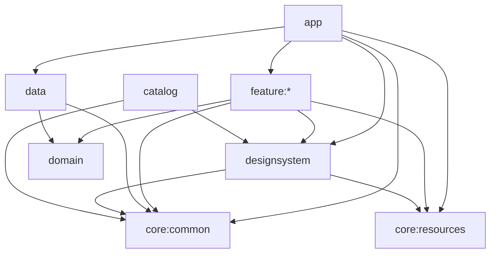

# 모듈 시스템과 의존성

이 문서는 D-14의 모듈 책임과 의존성 방향을 정의한다. 이 문서는
[`docs/ARCHITECTURE.md`](../ARCHITECTURE.md)가 편입한 상세 아키텍처 계약이며,
[`docs/CONSTITUTION.md`](../CONSTITUTION.md)의 하위 규칙이다.

## 1. 핵심 원칙

- 프로젝트는 Clean Architecture를 따른다.
- 의존성은 바깥 레이어에서 안쪽 레이어로만 향한다.
- 비즈니스 로직은 UI 구현, Android Framework와 data 구현 세부사항으로부터 독립적이어야 한다.
- 모듈 경계를 코드량 축소, 테스트 편의 또는 구현 속도를 이유로 약화하지 않는다.
- 공통 코드는 실제로 둘 이상의 모듈에서 사용되거나 사용할 계획이 있을 때만 공통 모듈로 이동한다.

## 2. 모듈 책임

| 모듈 | 책임 | Android 의존 |
|---|---|---|
| `app` | Application, Manifest, MainActivity, 앱 루트 Navigation 조립, 전역 UI 이벤트 처리 | O |
| `feature:*` | 화면별 MVI, Feature route와 entry 제공 | O |
| `domain` | Entity, Repository Interface, UseCase, 비즈니스 규칙 | X |
| `data` | Repository 구현, API, DTO, remote/local data source, Room, DataStore, DI | O |
| `designsystem` | Theme과 공용 Compose UI | X |
| `catalog` | Design System Story, Web/WASM Catalog | X |
| `catalog:annotations` | `@CatalogControls` 플랫폼 독립 계약 | X |
| `catalog:processor` | Catalog Controls JVM KSP code generator | X |
| `core:common` | 최소 공통 모델, MVI 기반, 오류와 전역 이벤트, util | 최소화 |
| `core:resources` | Android와 Web/WASM 공용 Compose Multiplatform 리소스 | X |

### 2.1 `app`

`app`은 Android 애플리케이션의 진입점이자 composition root다.

- `@HiltAndroidApp` Application과 Android Manifest 등록을 소유한다.
- `MainActivity`와 앱 루트 Navigation 3 조립을 소유한다.
- Feature가 제공한 route와 entry를 수집한다.
- 전역 Modal, Toast와 Snackbar를 앱 최상단에서 렌더링한다.
- Android 진입점과 앱 실행 설정을 관리한다.

`app`은 data에 Hilt binding과 composition root 구성 목적으로만 의존할 수 있다. 이 예외는
Repository 구현을 직접 호출해 비즈니스 로직을 수행할 권한이 아니다. 화면별 State와 Feature
비즈니스 로직도 `app`에 두지 않는다.

### 2.2 `feature:*`

Feature는 하나 이상의 화면과 해당 화면의 MVI 책임을 소유한다.

- 화면 State와 Intent를 정의한다.
- ViewModel에서 Intent를 처리하고 UseCase를 호출한다.
- Client Error를 화면별 State 또는 Effect로 처리한다.
- 화면 이동, Toast와 Snackbar 같은 일회성 Effect를 발행한다.
- Navigation 3 route 또는 entry 계약을 상위 앱 계층에 제공한다.

Feature는 `data`와 `app`에 의존하지 않는다. 다른 Feature의 구현이 필요하지 않도록 경계를
유지하고, 다른 Feature로 이동하는 데 route 계약이 필요할 때만 해당 Feature의 `api`에
의존한다.

Feature 내부에서만 사용하는 UI와 extension은 Feature 안에 둔다. 둘 이상의 Feature에서
재사용되기 시작하면 UI는 `designsystem`, UI와 무관한 코드는 `core:common`으로 이동한다.

### 2.3 `domain`

`domain`은 순수 Kotlin 모듈이다.

- Entity와 Domain Model을 정의한다.
- Repository Interface를 정의한다.
- UseCase와 비즈니스 규칙을 정의한다.
- UI와 무관한 도메인 결과 또는 예외를 표현할 수 있다.

`domain`은 Android Framework, `data`, `feature:*`에 의존하지 않고 UI 표현 정책을 결정하지
않는다.

### 2.4 `data`

`data`는 외부와 로컬 데이터 접근 구현을 소유한다.

- Domain Repository Interface를 구현한다.
- API Interface, Request/Response DTO와 RemoteDataSource를 정의한다.
- Room Entity, DAO, Database와 DataStore 접근을 정의한다.
- data-layer Hilt Module을 정의한다.
- 외부 Exception을 프로젝트 오류 모델로 변환하거나 상위로 전파한다.

`data`는 `feature:*`와 `app`에 의존하지 않고 UI 정책을 포함하지 않는다.

### 2.5 `designsystem`

`designsystem`은 Theme primitive와 공용 Compose UI를 소유하는 Compose Multiplatform 모듈이다.
Android Framework, Hilt, Android Navigation, Android Lifecycle, Android resource API,
`feature:*`, `app`에 의존하지 않는다. 상세 계약은
[`design-system.md`](design-system.md)를 따른다.

### 2.6 `catalog`

`catalog`는 Design System 검수와 커뮤니케이션을 위한 Web/WASM 개발 산출물이다. 제품 앱의
런타임 Feature가 아니며 Android Framework, `app`, Android Navigation, Hilt ViewModel, 실제
API와 제품 런타임 로직에 의존하지 않는다. 상세 계약은 [`catalog.md`](catalog.md)를 따른다.

### 2.7 `core:common`

`core:common`은 여러 모듈이 공유하는 최소한의 플랫폼 독립 요소를 관리한다.

- 공통 MVI Contract와 기반 ViewModel
- 공통 Result와 Error 모델
- 공통 route 또는 key 모델
- `GlobalAppEvent`와 `GlobalErrorHandler`
- 둘 이상의 모듈에서 실제로 필요한 extension과 util

Feature 전용 모델, 제품 로직과 서로 관련 없는 utility를 모으는 dumping ground로 사용하지
않는다.

### 2.8 `core:resources`

`core:resources`는 `app`, `feature:*`, `designsystem`이 공유하는 font, drawable과 string 같은
Compose Multiplatform 리소스 원본 및 공개 generated `Res` accessor를 소유한다.

UI 컴포넌트, Theme 조립과 제품 런타임 로직을 소유하지 않는다. Android Framework resource
API, Hilt, Android Navigation, Android Lifecycle, `app`, `feature:*` 구현에 의존하지 않는다.
Catalog 전용 리소스는 `catalog`가 소유하며 `core:resources`로 이동하지 않는다.

### 2.9 Catalog build-time 모듈

- `catalog:annotations`는 플랫폼 독립 `@CatalogControls` 계약을 소유한다.
- `catalog:processor`는 JVM 기반 KSP processor와 code generation을 소유한다.
- `catalog`는 annotation 모듈에 의존하고 Wasm compilation에서 processor를 사용한다.
- `designsystem`은 두 Catalog build-time 모듈에 의존하지 않는다.

## 3. 의존성 방향



## 4. 허용되는 의존성

| 의존성 | 허용 목적 |
|---|---|
| `app` → `feature:*` | route와 entry 수집 및 앱 루트 화면 전환 조립 |
| `app` → `data` | composition root와 Hilt binding |
| `app` → `designsystem` | Theme과 전역 UI 렌더링 |
| `app` → `core:common` | 전역 이벤트와 공통 계약 사용 |
| `app` → `core:resources` | 공용 CMP 리소스 사용 |
| `feature:*` → `domain` | UseCase와 Repository Interface 사용 |
| `feature:*` → `designsystem` | 공용 UI 사용 |
| `feature:*` → `core:common` | MVI 기반과 공통 모델 사용 |
| `feature:*` → `core:resources` | 공용 CMP 리소스 사용 |
| `feature:*:impl` → 다른 `feature:*:api` | route와 entry 계약 사용 |
| `data` → `domain` | Repository Interface 구현 |
| `data` → `core:common` | 공통 Result와 Error 사용 |
| `designsystem` → `core:common` | 플랫폼 독립 공통 계약 사용 |
| `designsystem` → `core:resources` | 공용 font, drawable과 string 사용 |
| `catalog` → `designsystem` | Composable을 Story로 노출 |
| `catalog` → `core:common` | Story에 필요한 플랫폼 독립 공통 계약 사용 |
| `catalog` → `catalog:annotations` | Controls adapter annotation 사용 |
| `catalog` -KSP→ `catalog:processor` | Wasm compilation code generation |
| `catalog:processor` → `catalog:annotations` | 처리할 annotation 계약 공유 |

## 5. 금지되는 의존성

- `feature:*` → `data`
- `feature:*` → `app`
- `feature:*:impl` → 다른 `feature:*:impl`
- `domain` → Android Framework, `data`, `feature:*`
- `data` → `feature:*`, `app`
- `designsystem` → Android Framework, Hilt, Android Navigation, Android Lifecycle,
  Android resource API, `feature:*`, `app`
- `catalog` → Android Framework, `app`, `core:resources`

별도 `:navigation` 또는 `:feature:navigator` 모듈도 만들지 않는다. Navigation 소유권은
[`navigation.md`](navigation.md)를 따른다.

## 6. Feature `api`와 `impl`

다른 모듈에 route key나 args 계약을 공개해야 하는 Feature는 `api`와 `impl`로 나눌 수 있다.

```text
feature/{name}/
├── api/    # route key와 args 계약
└── impl/   # Screen, ViewModel, entry builder와 DI
```

`feature:{name}:impl`은 다른 Feature의 `api`만 route 또는 entry 계약 목적으로 참조할 수 있다.
다른 Feature의 Screen, ViewModel, entry builder와 구현 세부사항은 직접 사용하지 않는다.
