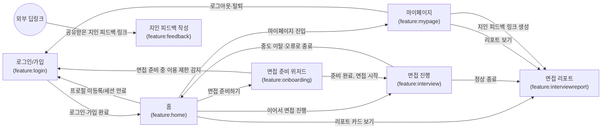

# 기능 간 연결 지도

이 문서는 앱을 구성하는 각 기능(Feature)이 사용자 흐름상 서로 어디로, 왜 연결되는지를
**기획 관점**에서 정리한 지도다. "무엇을 클릭하면 어디로 가는가"를 기준으로 삼고, Kotlin
클래스명·Effect명 같은 구현 세부사항은 최대한 배제한다. 새 기능을 추가하거나 기존 기능을
수정할 때 "이 화면이 다른 어떤 기능과 얽혀 있는지" 헷갈리지 않도록 참고하는 용도다.

## 1. 다른 문서와의 관계

| 문서 | 성격 | 이 문서와 다른 점 |
|---|---|---|
| `docs/prd/*.md` | 기능 하나의 조립 전 예측 스펙 | 단일 기능 안쪽만 다룸 |
| `docs/architecture/navigation.md` | Navigation 3 소유권·계층 책임 같은 기술 계약 | "어떻게 구현하는가"를 다룸(HOW) |
| `docs/work/assembly-log.md` | 기능을 실제로 조립하면서 확정된 코드 수준 사실의 시간순 기록 | 세션별 기록(언제, 무엇을 확정했는지), 코드 근거 포함 |
| 이 문서 | 여러 기능에 걸친 연결 지점을 사용자 흐름 기준으로 모은 지도 | 시간순이 아니라 "지금 이 순간의 전체 그림"(주제별), 코드 세부사항 배제 |

이 문서의 내용은 `assembly-log.md`에서 확정된 사실을 근거로 삼는다. 연결이 새로 생기거나
바뀌면 먼저 `assembly-log.md`에 조립 기록을 남기고, 그 사실을 반영해 이 문서를 갱신한다.
코드 수준 근거(어느 파일의 어느 콜백인지)가 필요하면 `assembly-log.md`를 확인한다.

## 2. 전체 연결 지도

`REPORT`(면접 리포트) 안에서 "영상 보기"·"지인 피드백 받기"는 같은 기능 내부 화면 전환이라
지도에는 표시하지 않았다(3절 참고). `FEEDBACK`(지인 피드백 작성)은 이 앱 안의 다른 어떤
기능에서도 진입하지 않고, 외부에서 공유받은 링크(딥링크)로만 진입한다 — 리포트 소유자가
"지인 피드백 링크 생성"으로 만드는 것은 이 링크이지, 화면 자체로 이동하는 것이 아니다.

## 3. 기능별 상세 연결

### 3.1 로그인/가입 (`feature:login`)

시작 화면(스플래시)을 소유하며, 앱 진입 시 가장 먼저 실행된다.

| 사용자 상황 | 도착 기능·화면 | 비고 |
|---|---|---|
| 앱 실행, 이미 가입·인증된 상태 | 홈 | |
| 앱 실행, 약관 미동의 | (자체) 약관 동의 화면 | |
| 앱 실행, 최초 가입이라 프로필 없음 | (자체) 가입 온보딩 화면 | 6.1절의 "가입 온보딩"과 이름이 비슷한 다른 기능이 있으니 주의 |
| 카메라·마이크 권한 거부 | (자체) 권한 거부 안내 화면 | |
| 계정 이용 제한 상태로 판정됨 | (자체) 이용 제한 안내 화면 | 트리거는 로그인 기능이 아니라 **면접 준비 위저드**(3.4절)에서 발생 — 화면 소유와 트리거 소유가 분리된 유일한 사례 |
| 권한 거부 안내·이용 제한 안내에서 "홈으로" | 홈 | |
| 가입 온보딩(프로필 등록) 완료 | 홈 | |

### 3.2 홈 (`feature:home`)

로그인 이후 진입하는 메인 허브. 다른 기능으로 가는 갈래가 가장 많다.

| 사용자 행동 | 도착 기능·화면 | 비고 |
|---|---|---|
| 마이페이지 탭/버튼 클릭 | 마이페이지 | |
| "면접 준비하기" | 면접 준비 위저드 | |
| 진행 중이던 면접 "이어서 진행" | 면접 진행 화면 | 실제로 이어갈 수 있는지 판정은 면접 진행 화면 자신이 다시 함 — 홈은 순수하게 그 화면으로 들여보내기만 한다 |
| 리포트 카드에서 "보기" | 면접 리포트 | |
| 프로필 미등록 상태로 판명 | (로그인 기능의) 가입 온보딩 | |
| 로그인 세션이 유효하지 않음 | (로그인 기능의) 스플래시 | |

### 3.3 마이페이지 (`feature:mypage`)

| 사용자 행동 | 도착 기능·화면 | 상태 |
|---|---|---|
| 리포트 목록에서 "리포트 보기" | 면접 리포트 | 연결됨 |
| 리포트 목록에서 "지인 피드백 받기" | 면접 리포트(지인 피드백 링크 생성 화면) | 연결됨 |
| 로그아웃 / 회원 탈퇴 완료 | (로그인 기능의) 스플래시 | 연결됨 |
| 프로필 편집 | — | **미연결.** 편집 후 원래 화면으로 돌아오는 시나리오를 지원하는 전용 디자인이 아직 없어 보류 중. 가입 온보딩 화면을 재사용할 수 없다는 것까지는 확인됨 |
| 포트폴리오 파일 선택 | — | 다른 기능이 아니라 Android 시스템 파일 선택창을 여는 로컬 동작(기능 간 연결 아님) |

### 3.4 면접 준비 위저드 (`feature:onboarding`)

면접 시작 전 최종 준비 단계(장비 점검 등)를 다루는 위저드. **가입 온보딩과는 다른 기능이니
6.1절을 꼭 확인할 것.**

| 사용자 상황 | 도착 기능·화면 | 비고 |
|---|---|---|
| 준비 완료, 면접 시작 | 면접 진행 화면 | |
| 준비 도중 "닫기" | (제자리, 홈으로 뒤로가기) | |
| 준비 도중 계정 이용 제한 상태로 판정됨 | (로그인 기능의) 이용 제한 안내 화면 | 화면은 로그인 기능 소유, 트리거만 이 기능이 발생시킴(3.1절 참고) |

### 3.5 면접 진행 (`feature:interview`)

| 사용자 상황 | 도착 기능·화면 | 비고 |
|---|---|---|
| 면접을 끝까지 정상적으로 마침 | 홈으로 이동한 뒤, 이어서 해당 면접의 리포트 화면 | 리포트에서 "뒤로가기" 하면 면접 화면이 아니라 홈으로 돌아간다 |
| 면접을 중도에 그만둠 | 홈 | 아직 리포트가 없는 상태라 리포트로 가지 않는다 |
| 진행 중 오류(네트워크, 권한, STT 등) 확인 후 재개 | (제자리, 면접 진행 화면으로 복귀) | |
| 진행 중 오류를 포기(중단)로 확정 | 홈 | |
| 시작 전 필수 조건 미충족(권한 거부 등) | 홈 | |

### 3.6 면접 리포트 (`feature:interviewreport`)

다른 기능에서 리포트로 "들어오는" 연결은 3.2절(홈)·3.3절(마이페이지)·3.5절(면접 진행)
세 곳뿐이다. 리포트 안에서의 화면 전환은 전부 이 기능 내부에서 완결되고 다른 기능으로
나가지 않는다.

| 리포트 안에서의 행동 | 이동 위치 |
|---|---|
| 영상 보기 | (같은 기능 내부) 리포트 영상 재생 화면 |
| 지인 피드백 받기 | (같은 기능 내부) 지인 피드백 링크 생성 화면 |
| 각 화면에서 뒤로가기 | 이전 화면으로 복귀(리포트 → 홈까지) |

지인 피드백 링크 생성 화면에서 만든 공유 링크는 앱 밖(카카오톡 등)으로 나가 지인에게
전달된다. 그 지인이 링크를 열었을 때 진입하는 곳이 3.7절의 "지인 피드백 작성" 기능이다 —
같은 "피드백"이라는 이름이 붙어 있지만 완전히 다른 기능이니 6.1절을 확인할 것.

### 3.7 지인 피드백 작성 (`feature:feedback`)

리포트 소유자가 아니라 **링크를 받은 지인(게스트)**이 사용하는 기능. 앱 내 다른 어떤
기능에서도 이 기능으로 이동하지 않는다 — 유일한 진입 경로는 공유받은 링크를 열었을 때
발생하는 딥링크뿐이다. 진입 이후(안내 → 피드백 작성 → 제출 완료)는 전부 이 기능 내부에서
끝나고 다른 기능으로 나가지 않는다.

## 4. 진입점 정리

| 진입점 | 도착 | 성격 |
|---|---|---|
| 앱을 처음 열거나 재실행 | 스플래시(로그인 기능) | 앱의 유일한 시작 화면 |
| 지인이 공유받은 피드백 링크를 열었을 때 | 지인 피드백 작성 기능 | 앱 밖(딥링크)에서 들어오는 유일한 진입점 |

## 5. 아직 실제 흐름에 연결되지 않은 것

- 마이페이지의 "프로필 편집"(3.3절): 디자인이 아직 나오지 않아 목적지 자체가 없다.

## 6. 헷갈리기 쉬운 것

### 6.1 이름이 비슷한 서로 다른 기능

| 이름 | 소속 기능 | 성격 |
|---|---|---|
| 가입 온보딩 | `feature:login` | 최초 가입 시 프로필(직군·연차·포트폴리오 등)을 등록하는 화면 |
| 면접 준비 위저드 | `feature:onboarding` | 매 면접 시작 전 장비 점검 등을 거치는 위저드(3.4절) |

Gradle 모듈명이 `feature:onboarding`인 쪽이 오히려 "가입 온보딩"이 아니라 "면접 준비
위저드"라는 점을 헷갈리지 말 것.

| 이름 | 소속 기능 | 성격 |
|---|---|---|
| 지인 피드백 링크 생성 | `feature:interviewreport` | 리포트 소유자가 공유 링크를 만드는 화면(3.6절) |
| 지인 피드백 작성 | `feature:feedback` | 링크를 받은 지인이 실제로 피드백을 작성·제출하는 화면(3.7절) |

### 6.2 화면 소유와 이동 트리거가 분리된 사례

"이용 제한 안내" 화면은 `feature:login`이 소유하지만, 실제로 그 화면으로 이동하라는 신호는
`feature:onboarding`(면접 준비 위저드, 면접 세션 생성 시점)에서 발생한다(3.1절·3.4절). 이
문서에 나온 연결 중 화면 소유 기능과 트리거 발생 기능이 다른 유일한 사례다. 새 기능이
다른 기능의 화면으로 이동해야 하는데 그 화면을 만들 필요는 없는 상황이라면 이 사례를
참고할 것.

## 7. 이 문서를 갱신해야 하는 시점

- 새 기능을 조립해 다른 기능과 처음 연결할 때
- 기존 연결의 목적지나 조건이 바뀔 때(예: 미배선 상태였던 연결이 실제로 배선됨)
- `assembly-log.md`에 "남은 이슈"로 남아있던 연결 공백이 해소됐을 때

갱신 순서는 항상 `assembly-log.md`에 조립 기록을 먼저 남긴 뒤, 그 절을 근거로 이 문서의
해당 절을 고친다. 이 문서만 단독으로 갱신하지 않는다.
